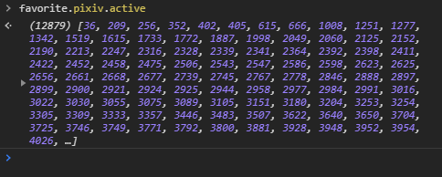
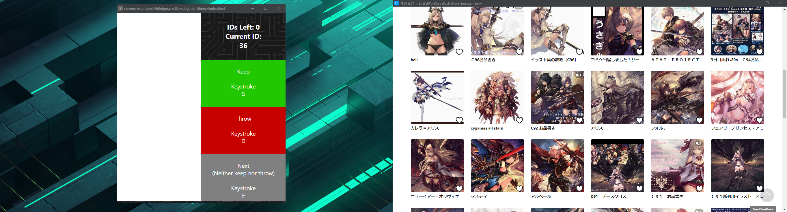

# The Idea


One day, This idea come to my mind:
```
Maaaaaan, I got roughly 12k IDs of Pixiv User. But how do we can take a fast look at them and decide which to keep, which to put into exclude and which is ... ah, just ignore it.
```

# Requires
* Chromium-based browser
* Apache server (LAMP / AMPPS / XAMPP / etc)

# TLDR:
* Can order the URL Params
* Can inject script to web if catch certain request
* Open popup when clicked to Extension Icon
* If open anything in new tab -> It will open in the window that you open the extension (just try then you'll get what I'm sayin')

# Screenshot
